| **Date** | September 30 / October 1, 2023 |
| **Location** | The workshop will be held *in-person* at the [ECAI 2023](https://ecai2023.eu) conference in Kraków, Poland. |

# Call for Papers

Welcome to the Joint workshops on XAI methods, challenges and applications **(XAI^3)**, where we aim to discuss opportunities for the new generation of explainable AI (XAI) methods that are reliable, robust, and trustworthy. Explainability of AI models and systems is crucial for humans to trust and use intelligent systems, yet their utility in high-risk applications such as healthcare and industry has been severely limited. Our workshop will have three tracks: medical, industry, and future challenges, where we will explore the challenges and opportunities in creating useful XAI methods for medical applications, integrating explainability in highly automated industrial processes, and evaluating current and future XAI methods. We welcome contributions from researchers, academia, and industries primarily from a technical and application point of view, but also from an ethical and sociological perspective. Join us in discussing the latest developments in XAI and their practical applications at the 26th European Conference on Artificial Intelligence **(ECAI 2023)** in Kraków, Poland.

## Tracks and topics

|{::nomarkdown} Towards Explainable AI 2.0 (XAI2.0) <text class="chair">Chair: Przemysław Biecek</text> {:/}|{::nomarkdown} Explainable AI for Medical Applications (XAIM) <text class="chair">Chair: Neo Christopher Chung</text> {:/}|{::nomarkdown} XAI for Industry 4.0 & 5.0 (XAI4I) <text class="chair">Chair: Sławomir Nowaczyk</text> {:/}|
| --- | --- | --- |
|{::nomarkdown}<ul><li>Emerging challenges in explainable AI towards XAI 2.0</li><li>Evaluation and limitations of current XAI methods</li><li>Trade-off between model-agnostic and model-specific explainability</li><li>Adversarial attacks and defenses in XAI</li><li>Privacy, leakage of sensitive information, fairness and bias</li><li>Human-centered XAI through visualization, active learning, model improvement and debugging</li><li>XAI beyond classification and regression, e.g. in unsupervised learning, image segmentation, survival analysis</li></ul>{:/}|{::nomarkdown}<ul><li>Theory and application of XAI for medical imaging and other medical applications</li><li>Uncertainty estimation of AI models using medical data</li><li>Multimodal learning, e.g., PET/CT, healthcare records, genomics, and other heterogeneous datasets</li><li>Clinical cases, evaluation, and software of XAI for medicine</li><li>Fairness, bias, and transparency in medical AI models</li><li>Human-computer interaction (HCI) and human in the loop (HITL) approaches in medicine</li><li>Inherently interpretable models in supervised, unsupervised and semi-supervised learning for biology and medicine</li></ul>{:/}|{::nomarkdown}<ul><li>Ethical considerations in industrial deployment of AI</li><li>AI transparency and accountability in smart factories</li><li>Explainable systems fusing various sources of industrial information</li><li>XAI in performance and efficiency of industrial systems</li><li>Prediction of maintenance, product, and process quality</li><li>Data and information fusion in the industrial XAI context</li><li> Application in manufacturing systems, production processes, energy, power, and transport systems</li></ul>{:/}|

## Dates

| **Paper submission deadline** | June 12, 2023 |
| **Decision notification** | August 02, 2023 |
| **Camera-ready due** | August 15, 2023 |

All times Anywhere on Earth (AoE), UTC-12

## Submission instructions

Submissions should follow the **ECAI 2023 format** available at [https://ecai2023.eu/ECAI2023](https://ecai2023.eu/ECAI2023).

We welcome **max 7-page** submissions of papers. The page limit **does not** include references and supplementary material.

All submissions should be in the **anonymized** ECAI 2023 format available at [https://vtex-soft.github.io/texsupport.iospress-ecai](https://vtex-soft.github.io/texsupport.iospress-ecai).

Submissions can be done at TBA.

*Overlength or non-anonymized submissions will be rejected without review.*

# Invited Speakers

TBA

<!-- # Program Comittee

TBA -->

# Organizers

|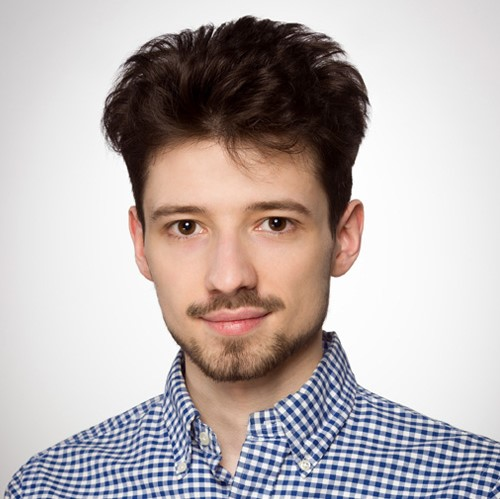|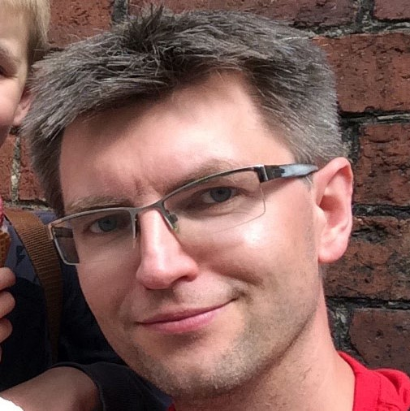|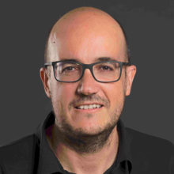|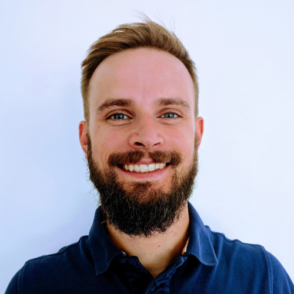|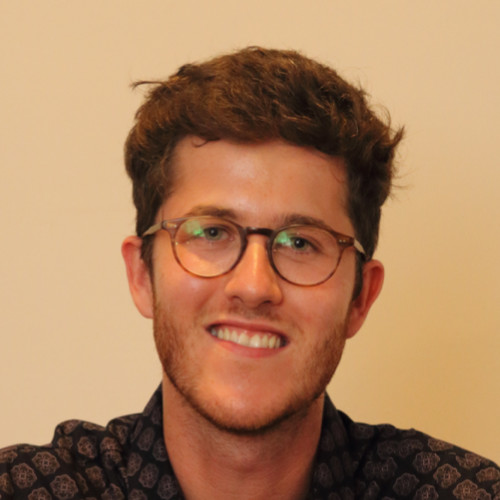|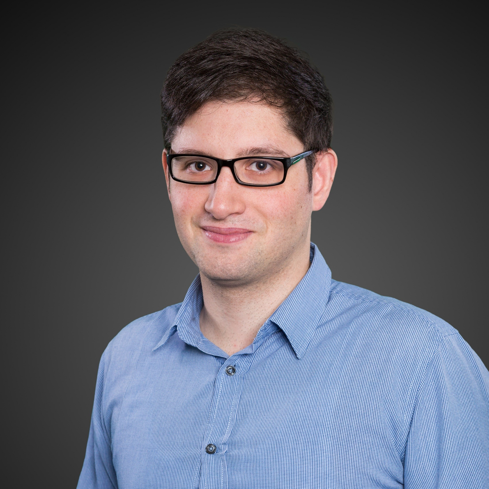|
|[Hubert Baniecki](https://hbaniecki.com) University of Warsaw|[Przemysław Biecek](https://pbiecek.github.io) Warsaw University of Technology|[Albert Bifet](https://albertbifet.com) Telecom-ParisTech|[Szymon Bobek](https://szymon.bobek.re) Jagiellonian University|[Lennart Brocki](https://scholar.google.ca/citations?user=cwkj0T0AAAAJ) University of Warsaw|[Giuseppe Casalicchio](https://www.slds.stat.uni-muenchen.de/people/casalicchio/) Ludwig Maximilian University of Munich|

||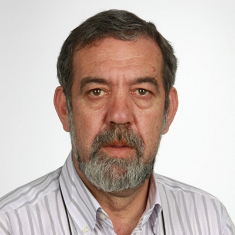|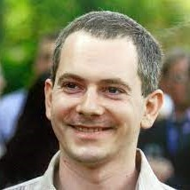|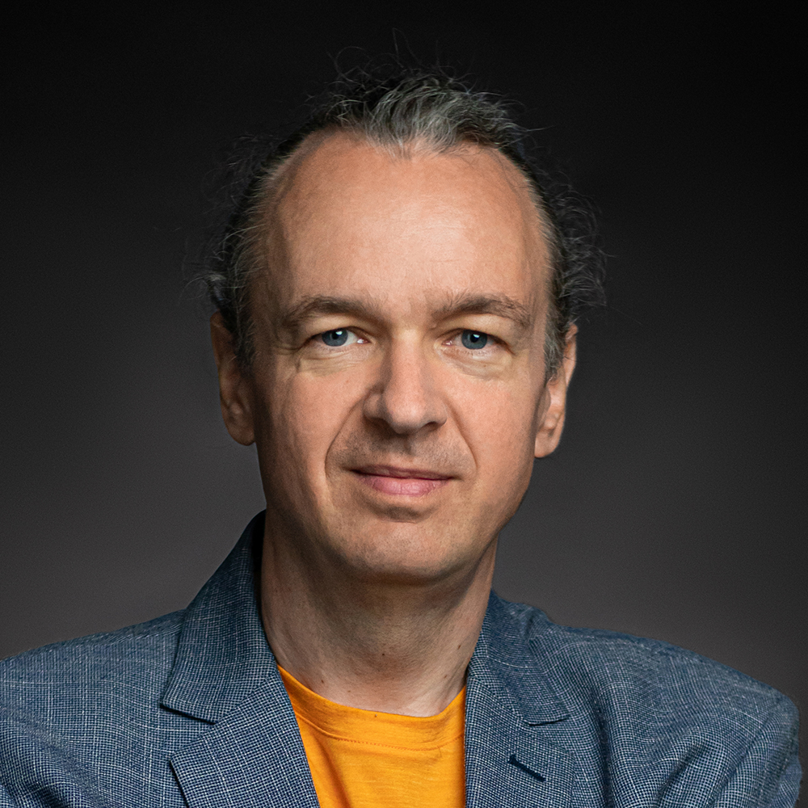|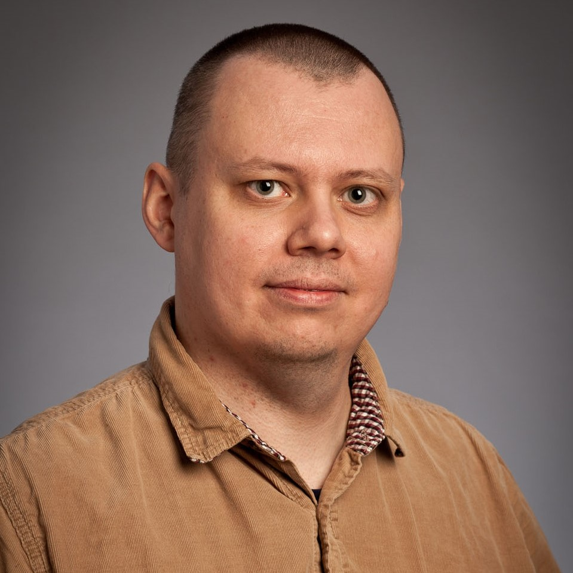||
|[Neo Christopher Chung](https://cbml.science/) University of Warsaw|[Joao Gama](http://www.liaad.up.pt/area/jgama) University of Porto|[Mathieu Hatt](http://mathhatt.free.fr) LaTIM|[Grzegorz J. Nalepa](https://gjn.re/wiki/doku.php) Jagiellonian University|[Sławomir Nowaczyk](https://wiki.hh.se/caisr/index.php/Slanow) Halmstad University|[Panagiotis Papadimitroulas](https://www.researchgate.net/profile/Panagiotis-Papadimitroulas) BIOEMTECH|

|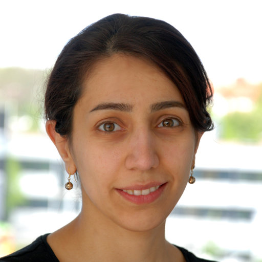|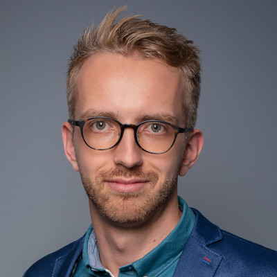|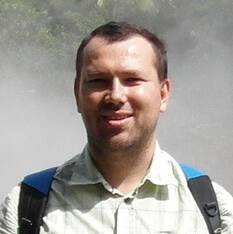||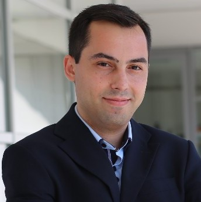|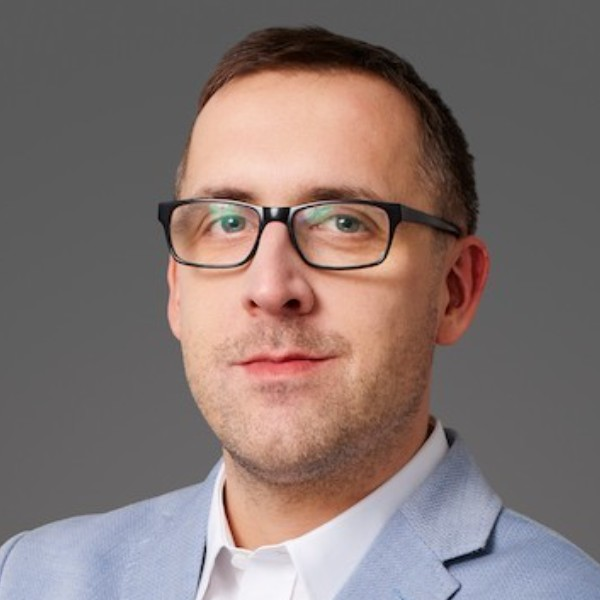|
|[Sepideh Pashami](https://wiki.hh.se/caisr/index.php/Sepideh_Pashami) Halmstad University|[Dawid Rymarczyk](https://scholar.google.com/citations?user=QLAFuXYAAAAJ) Jagiellonian University|[Jacek Tabor](https://scholar.google.pl/citations?user=zSKYziUAAAAJ) Jagiellonian University|[Rita P. Ribeiro](https://scholar.google.com/citations?user=ptDBgpkAAAAJ) University of Porto|[Bruno Veloso](https://brunomveloso.github.io) University of Porto|[Bartosz Zieliński](https://bartoszzielinski.github.io) Jagiellonian University|

# Contact

**Email**: <a href="mailto:xai3ecai2023@googlegroups.com">xai3ecai2023@googlegroups.com</a>