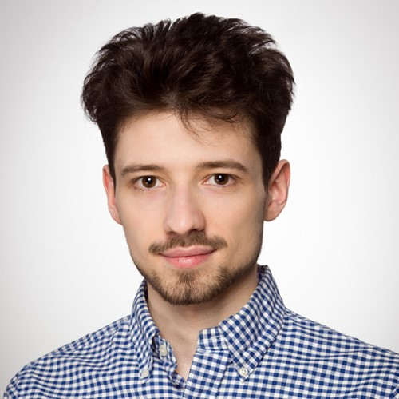
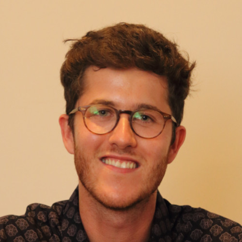
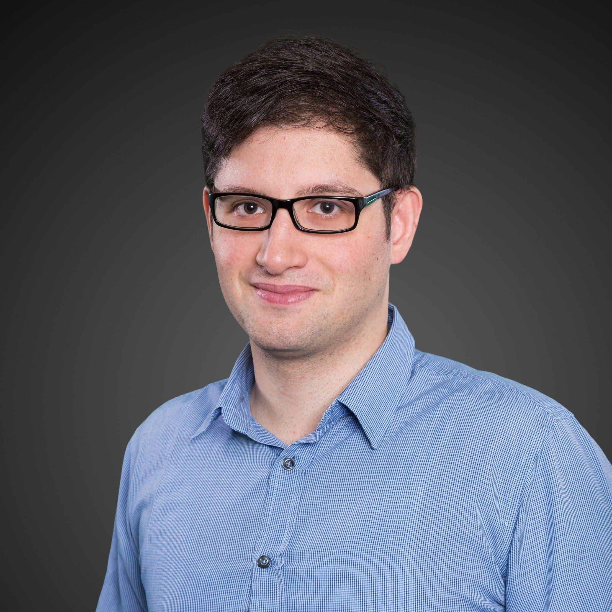
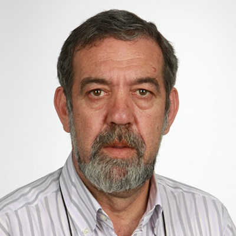
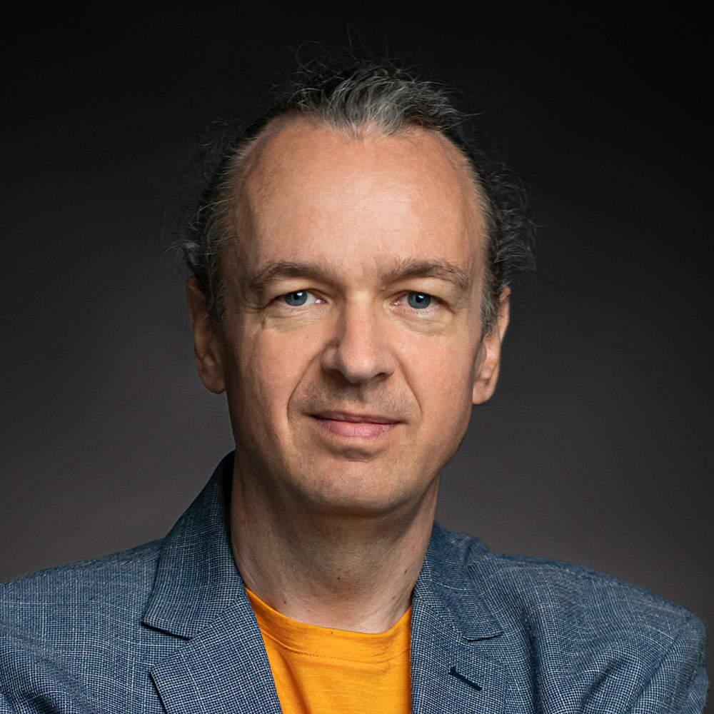
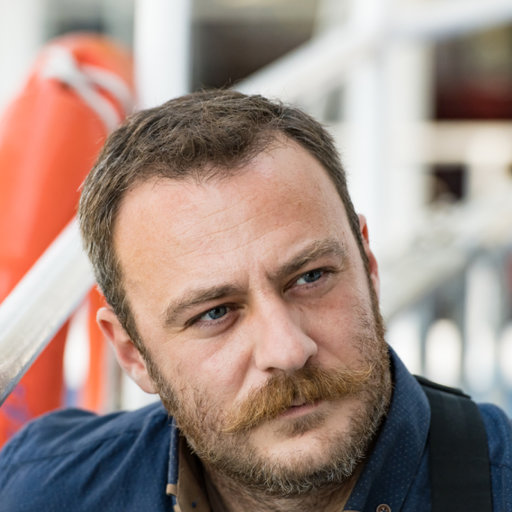
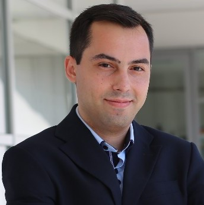

| **Date** | October 1, 2023 |
| **Location** | The workshop will be held **in-person** at the [**ECAI 2023**](https://ecai2023.eu) conference in Kraków, Poland. |
| **Room** | A-1-13 in the [Faculty of Physics, Astronomy and Applied Computer Science](https://maps.app.goo.gl/Aq55uToHLzjCxioi6) of the Jagiellonian University |

# Organizers

|||||||
|[Hubert Baniecki](https://hbaniecki.com) University of Warsaw|[Przemysław Biecek](https://pbiecek.github.io) Warsaw University of Technology|[Albert Bifet](https://albertbifet.com) Telecom-ParisTech|[Szymon Bobek](https://szymon.bobek.re) Jagiellonian University|[Lennart Brocki](https://scholar.google.ca/citations?user=cwkj0T0AAAAJ) University of Warsaw|[Giuseppe Casalicchio](https://www.slds.stat.uni-muenchen.de/people/casalicchio/) Ludwig Maximilian University of Munich|

|||||||
|[Neo Christopher Chung](https://cbml.science/) University of Warsaw|[Joao Gama](http://www.liaad.up.pt/area/jgama) University of Porto|[Mathieu Hatt](http://mathhatt.free.fr) LaTIM|[Grzegorz J. Nalepa](https://gjn.re/wiki/doku.php) Jagiellonian University|[Sławomir Nowaczyk](https://wiki.hh.se/caisr/index.php/Slanow) Halmstad University|[Panagiotis Papadimitroulas](https://www.researchgate.net/profile/Panagiotis-Papadimitroulas) BIOEMTECH|

|||||||
|[Sepideh Pashami](https://wiki.hh.se/caisr/index.php/Sepideh_Pashami) Halmstad University|[Rita P. Ribeiro](https://scholar.google.com/citations?user=ptDBgpkAAAAJ) University of Porto|[Dawid Rymarczyk](https://scholar.google.com/citations?user=QLAFuXYAAAAJ) Jagiellonian University|[Jacek Tabor](https://scholar.google.pl/citations?user=zSKYziUAAAAJ) Jagiellonian University|[Bruno Veloso](https://brunomveloso.github.io) University of Porto|[Bartosz Zieliński](https://bartoszzielinski.github.io) Jagiellonian University|

# Co-organized and supported by

 